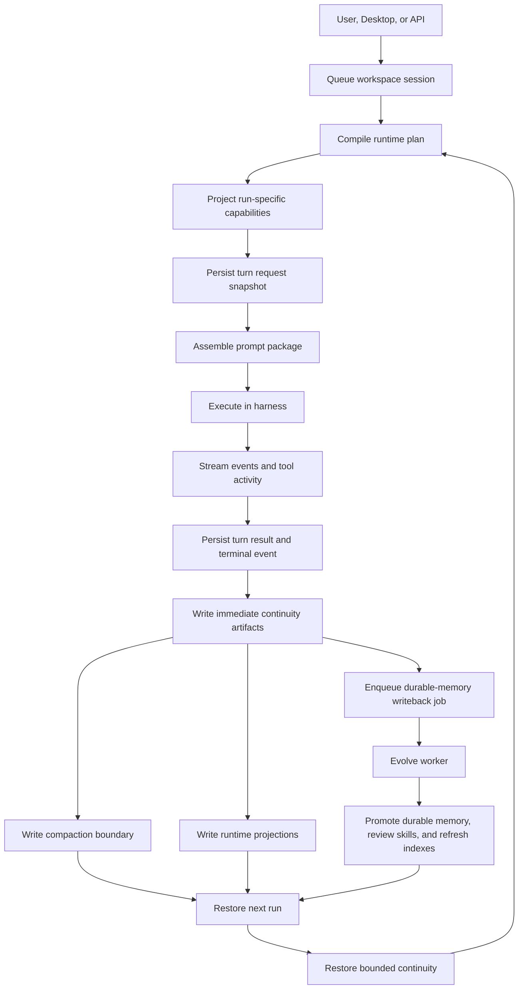

# Holaboss - AI Workspace Desktop for Business

<p align="center">
  
</p>

<p align="center"><strong>Build, run, and package AI workspaces and workspace templates with a desktop app and portable runtime.</strong></p>

<p align="center">
  <a href="https://github.com/holaboss-ai/holaboss-ai/actions/workflows/oss-ci.yml"></a>
  
  
  
  
  
</p>

<p align="center">
  <a href="https://www.holaboss.ai/?utm_source=github&utm_medium=oss&utm_campaign=hola_boss_oss&utm_content=readme_nav_website">Website</a> ·
  <a href="https://www.holaboss.ai/docs?utm_source=github&utm_medium=oss&utm_campaign=hola_boss_oss&utm_content=readme_nav_docs">Docs</a> ·
  <a href="https://www.holaboss.ai/signin?utm_source=github&utm_medium=oss&utm_campaign=hola_boss_oss&utm_content=readme_nav_signin">Sign in</a> ·
  <a href="#getting-started">Getting Started</a>
</p>

Holaboss enables you to build AI workspaces that go beyond one-off task execution. Each workspace packages instructions, tools, apps, memory, and runtime state for sustained long-horizon operation. You can manage multiple workspaces in parallel, and because workspaces and workspace templates are portable, they can be packaged, shared, resumed, and reused across the Holaboss ecosystem.


## Marketplace Experience

<p align="center">
  <a href="https://www.holaboss.ai/?utm_source=github&utm_medium=oss&utm_campaign=hola_boss_oss&utm_content=readme_marketplace_image">
    
  </a>
</p>

## Desktop Workspace

<p align="center">
  
</p>

## Star the Repository

<p align="center">
  
</p>

<p align="center"><strong>If Holaboss is useful or interesting, a GitHub Star would be greatly appreciated.</strong></p>

## Table of Contents

- [Getting Started](#getting-started)
  - [Prerequisites](#prerequisites)
  - [One-Line Agent Setup](#one-line-agent-setup)
  - [Quick start](#quick-start)
- [Architecture Overview](#architecture-overview)
  - [Execution And Continuity](#execution-and-continuity)
  - [Current Workspace Structure](#current-workspace-structure)
  - [Memory](#memory)
- [Workspace Marketplace](#workspace-marketplace)
- [Hosted Features](#hosted-features)
  - [What works in OSS](#what-works-in-oss)
  - [What may require Holaboss backend access](#what-may-require-holaboss-backend-access)
- [Technical Details](#technical-details)
  - [Repository layout](#repository-layout)
  - [Common commands](#common-commands)
  - [Development notes](#development-notes)
- [Model Configuration](#model-configuration)
- [Independent Runtime Deploy](#independent-runtime-deploy)
  - [Linux](#linux)
  - [macOS](#macos)
  - [Notes](#notes)
- [OSS Release Notes](#oss-release-notes)

## Getting Started

### Prerequisites

- Node.js 22+
- npm

### One-Line Agent Setup

If you use Codex, Claude Code, Cursor, Windsurf, or another coding agent, you can hand it the setup instructions in one sentence:

```text
Clone the Holaboss repo from https://github.com/holaboss-ai/holaboss-ai.git if needed, or use the current checkout if it is already open, then follow INSTALL.md exactly to bootstrap local desktop development. If the environment cannot open Electron, stop after verification and tell me the next manual step.
```

That prompt is meant for coding agents. It stays self-contained by naming the repo and clone URL, while leaving the actual installation details in the repo-local `INSTALL.md` runbook.

### Quick start

This is the baseline installation flow for local desktop development.

Install the desktop dependencies:

```bash
npm run desktop:install
```

Copy the desktop env template and fill in the required values:

```bash
cp desktop/.env.example desktop/.env
```

If you want to verify the desktop code before launching the app, run:

```bash
npm run desktop:typecheck
```

Run the desktop app in development:

```bash
npm run desktop:dev
```

`npm run desktop:dev` already runs the desktop `predev` hook for you. That hook validates the dev environment, rebuilds native modules, and ensures a staged runtime bundle exists under `desktop/out/runtime-<platform>`. If the bundle is missing or older than your local runtime sources, it automatically runs `npm run desktop:prepare-runtime:local`.

If you want to stage the local runtime bundle from this repo explicitly ahead of time, you can still run:

```bash
npm run desktop:prepare-runtime:local
```

If you want to stage the latest released runtime bundle for your current host platform instead of rebuilding from local runtime sources:

```bash
npm run desktop:prepare-runtime
```

`desktop:prepare-runtime` pulls the latest published runtime bundle for the current platform from GitHub Releases and stages it into `desktop/out/runtime-<platform>`. `desktop:prepare-runtime:local` builds the runtime from your local source checkout and then stages that local bundle into the same location.

## Architecture Overview

At its core, Holaboss is built to support long-horizon agent operation. The design target is not isolated task execution, but role-holding work that has to persist across many runs inside the same workspace. In that setting, the agent has to preserve objectives, operating policy, reusable procedures, recent execution state, blockers, and durable user context without letting prompt cost grow without bound. Continuity therefore does not live only inside an ever-growing transcript. The runtime externalizes it into explicit runtime artifacts, bounded durable memory, and a structured workspace contract so the system can keep context over time while controlling token growth, preserving inspectability, and keeping workspaces portable across the Holaboss ecosystem.

For proactive flows specifically, proposal ideation currently lives in the hosted Holaboss control plane, while proposal persistence, accepted proposal execution, and memory continuity stay local to the OSS runtime.

### Long-Horizon Design At A Glance

The architectural distinction is between a run-centric agent and a workspace-centric system that can keep holding the same work over time. Holaboss supports that by separating state by authority instead of mixing everything into chat history:

| Concern | Run-Centric Agent | Holaboss |
| --- | --- | --- |
| Workspace policy | Hidden inside prompt text or prior chat | Kept in authored files such as `AGENTS.md`, `workspace.yaml`, `skills/`, and `apps/` |
| Runtime continuity | Rebuilt by replaying more history | Restored from `turn_results`, compaction boundaries, request snapshots, and `session-memory` |
| Long-lived knowledge | Buried in old messages | Promoted into governed durable memory under `memory/workspace/`, `preference/`, and `identity/` |
| Prompt growth | Tends to grow with session length | Split into stable and volatile prompt sections with a `prompt_cache_profile` |
| Execution surface | Implied from prompt text | Projected per run as a capability manifest before the harness sees it |
| Portability | Usually a chat export or opaque backend state | A structured workspace package with a stable filesystem contract |

That split is deliberate. Long-horizon support depends on keeping different kinds of context in the right system surfaces instead of mixing them together. `workspace.yaml` stays machine-readable as the runtime plan, while `AGENTS.md` stays the preferred human-authored instruction surface when a workspace needs authored prompt policy. The runtime compiler rejects inline prompt bodies in `workspace.yaml` and loads workspace instructions from `AGENTS.md` when present, which prevents the workspace plan from turning into an unstructured prompt blob.

Memory access is also intentionally scoped. The memory service only allows paths under:

- `MEMORY.md`
- `workspace/<workspace-id>/*`
- `preference/*`
- `identity/*`

Within those scopes, durable recalled memory is governed by type rather than treated as generic notes:

- `preference` and `identity` memories are treated as stable user context
- `fact`, `procedure`, and `blocker` memories are treated as workspace-sensitive operational knowledge
- `reference` memories are treated as time-sensitive and usually need reconfirmation before action

That is what allows Holaboss to support role-holding work across long sessions without flattening all prior interaction into one undifferentiated transcript.

### One Run Lifecycle

One run follows a bounded lifecycle:

1. The desktop or API queues work for a workspace session.
2. The runtime compiles the workspace from `workspace.yaml` plus referenced files such as `AGENTS.md`, app manifests, and workspace-local skill surfaces.
3. The runtime evaluates the capability surface for that run, builds prompt sections, computes a `prompt_cache_profile`, and prepares a sanitized request snapshot fingerprint.
4. Before the harness starts, the runtime persists the turn request snapshot for that run so the execution package is inspectable even if later work fails.
5. The harness receives a reduced execution package containing the selected model, `system_prompt`, ordered `context_messages`, prompt layers, capability manifest, and workspace checksum.
6. When the run finishes, the runtime persists the assistant turn, `turn_results`, token usage, and the terminal event immediately so the run can complete without waiting on follow-up writeback.
7. The runtime then performs a small immediate continuity writeback inline: compact the turn, refresh runtime projections such as `session-memory`, and persist the current compaction boundary.
8. After continuity is durable, the runtime enqueues a persistent evolve job for heavier follow-up work such as durable-memory extraction, durable-memory promotion, skill review, candidate skill generation, and scope-aware durable-index refresh.
9. On the next run, continuity is restored from the latest prior compaction boundary, a bounded `session-memory` excerpt, and a small recalled-memory subset instead of replaying the full transcript.

That split is intentional. Post-run continuity work is valuable, but it is not allowed to hold the run open after the agent has already finished outputting. The foreground path ends at committed run state, while continuity-enhancement tasks continue asynchronously as best-effort follow-up work.



### Why Token Usage Stays Bounded

The long-horizon claim depends on concrete mechanisms, not just stored history:

| Mechanism | Runtime Artifact | Why It Matters |
| --- | --- | --- |
| Section-based prompts | `prompt_sections`, `prompt_layers` | Keeps workspace policy, resume context, recalled memory, and capability policy separate instead of flattening everything into one prompt body |
| Stable vs volatile prompt separation | `prompt_cache_profile` with `cacheable_section_ids`, `volatile_section_ids`, `cacheable_fingerprint`, `volatile_fingerprint` | Lets stable runtime and workspace instructions stay reusable while only run-volatile context changes |
| Durable compaction handoff | compaction boundaries | Stores compact summaries, restoration order, preserved turn ids, restored memory paths, and request snapshot fingerprints |
| Session continuity snapshot | `memory/workspace/<workspace-id>/runtime/session-memory/` | Provides a compact operational summary of recent state, user requests, progress, and errors |
| Bounded durable recall | staged recall over durable markdown memory, durable indexes, and optional vector candidate narrowing | Caps candidate sets, clips snippets, excludes `/runtime/` files, and selects only a small relevant subset |
| Per-run visibility | prompt ids, capability fingerprint, request snapshot fingerprint, token usage | Makes long-horizon cost and continuity inspectable instead of hidden inside raw transcript logs |

Compaction boundaries are central to that design. A boundary is more than a summary. It records:

- a compact boundary summary
- recent runtime context
- restoration order
- preserved turn ids
- restored memory paths
- the request snapshot fingerprint associated with the run

On the next run, the runtime restores continuity from the latest prior compaction boundary first, then adds a bounded `session-memory` excerpt rather than replaying the full transcript. If no prior boundary exists, it falls back to a bounded set of recent turn results and session messages. The `session-memory` snapshot itself is intentionally compact: it captures current state, recent user requests, recent runtime progress, and recent errors or permission denials without forcing the next run to ingest the full historical conversation again.

### Harness And Capability Discipline

Before a run reaches the harness, the runtime decides what the harness is allowed to see and do:

| Runtime Decision | Result Passed To Harness |
| --- | --- |
| selected provider and model target | model client config plus provider/model ids |
| prompt section assembly | composed `system_prompt`, ordered `context_messages`, and prompt layers |
| cache behavior | `prompt_cache_profile` |
| visible and callable capabilities | capability manifest plus reduced tool map |
| workspace versioning boundary | `workspace_config_checksum` |
| run-specific scope | session kind, browser/runtime tools, workspace skills, current MCP tool visibility, and workspace command references |

Capability visibility is therefore decided per run rather than inferred implicitly from workspace contents. The runtime determines which tools, skills, and current MCP tool surfaces are visible and callable for that run, and which workspace command references are attached as non-callable metadata. The harness receives only that projected surface. In the PI harness, workspace-root path checks keep resolved paths inside the workspace by default, which makes long-horizon execution safer and more reproducible.

### The Workspace Hierarchy Is Part Of The Optimization Story

The workspace tree is not just a packaging detail. It gives the runtime stable places to store different classes of state:

- `AGENTS.md` for human-authored workspace policy
- `workspace.yaml` for the runtime plan
- `skills/` for workspace-local reusable skills
- `apps/` for packaged app modules
- `.holaboss/` for runtime-managed session and attachment state
- `memory/` for durable recall surfaces
- `state/runtime.db` for runtime continuity and metadata

By keeping authored policy, runtime continuity, and durable memory separate, Holaboss avoids transient execution artifacts polluting reusable workspace definition. That makes workspaces easier to resume, inspect, and evolve over long horizons.

### Portability Is A Product Property, Not A Marketing Claim

Workspaces can be created from:

- an empty scaffold
- a local template folder
- a marketplace template

All of those paths materialize into the same workspace structure. The desktop creation path materializes templates locally, ensures required files such as `workspace.yaml` exist, and initializes each workspace as its own local git repository for agent-managed checkpoints and recovery.

Packaging is filtered intentionally. Workspace exports omit runtime state, `.holaboss`, common build outputs, `node_modules`, `.env*`, logs, database files, obviously sensitive filenames, and non-selected apps. What travels is the reusable operating unit:

- workspace plan and instruction surface
- selected apps and skills
- template metadata
- durable workspace definition

In practice, a Holaboss workspace is not just a prompt bundle or a chat log. It is a portable operating environment for long-horizon AI execution.

### Runtime Continuity Artifacts

The runtime keeps several different state surfaces on purpose:

- raw streamed events for replay and live UI updates
- normalized turn artifacts for querying, debugging, and continuity
- runtime-owned operator profile state for canonical user identity
- markdown memory projections for human-readable runtime state and durable recalled knowledge

The most important runtime continuity artifacts are:

- `turn_results`
  - one normalized record per run with status, stop reason, token usage, prompt-section ids, request fingerprint, capability fingerprint, and assistant output
- compaction boundaries
  - durable handoff artifacts that summarize a run boundary, record recent runtime context, preserve selected turn ids, restored memory paths, request snapshot fingerprints, and define explicit restoration ordering
- session-memory projections
  - per-session markdown continuity snapshots under `memory/workspace/<workspace-id>/runtime/session-memory/` used for fast resume context in later runs
- request snapshots
  - sanitized exact request-state artifacts used for replay, debugging, and future cache diagnostics
- runtime user profile
  - canonical operator identity fields such as the persisted display name used by the runtime and agent prompt context

This split avoids overloading transcript history with too many jobs. Raw history still supports replay, but resume, compaction, and memory promotion operate from durable higher-level artifacts rather than repeatedly scraping prior messages.

### Current Workspace Structure

Holaboss workspaces live under the runtime sandbox root. In the desktop app, that root is the local `sandbox-host` data directory; in standalone runtime deploys it defaults to `/holaboss`. The file tree below is the concrete expression of the policy/runtime/memory split described above.

```text
<sandbox-root>/
  state/
    runtime-config.json
    runtime.db

  workspace/
    .holaboss/
      workspace-mcp-sidecar-state.json
      <server>.workspace-mcp-sidecar.stdout.log
      <server>.workspace-mcp-sidecar.stderr.log

    <workspace-id>/
      .git/
      AGENTS.md
      workspace.yaml
      ONBOARD.md
      skills/
        <skill-id>/
          SKILL.md
      apps/
        <app-id>/
          app.runtime.yaml
      .holaboss/
        workspace_id
        harness-session-state.json
        input-attachments/<batch-id>/*
        pi-agent/auth.json
        pi-agent/models.json
        pi-sessions/...
      ...

  memory/
    MEMORY.md
    workspace/
      <workspace-id>/
        MEMORY.md
        runtime/
          latest-turn.md
          session-state/
          session-memory/
          recent-turns/
          blockers/
          permission-blockers/
        knowledge/
          facts/
          procedures/
          blockers/
          reference/
    preference/
      MEMORY.md
      *.md
    identity/
      MEMORY.md
      *.md
```

- `workspace.yaml` is the root runtime plan for the workspace. It defines the single active agent, skill enablement/order, MCP registry, and any installed workspace apps.
- `AGENTS.md` is the recommended root prompt file when a workspace needs authored instructions. Workspace prompt policy belongs there rather than inline in `workspace.yaml`.
- each new workspace is initialized as a local git repository after its scaffold or template is materialized. That repository is intended for agent-owned local version control checkpoints rather than remote sync.
- `skills/` is the fixed workspace-local skill directory. Workspace-local skills are discovered from `<workspace-root>/skills`, each skill directory must contain `SKILL.md`, and the runtime merges that local skill set with embedded skills when it builds the per-run skill surface.
- `apps/` contains workspace-local apps. Each installed app lives under `apps/<app-id>/` and must provide `app.runtime.yaml`.
- `<workspace-id>/.holaboss/` stores runtime-managed workspace state such as the identity marker, persisted harness session mapping, staged input attachments, and Pi harness state.
- `workspace/.holaboss/` is separate from the per-workspace `.holaboss/` directory. It stores shared workspace-root state for MCP sidecars and their logs.
- `state/runtime.db` is the durable runtime registry for workspaces, sessions, bindings, queue state, turn results, compaction boundaries, request snapshots, and durable memory catalog metadata. The `workspace_id` file exists mainly as an on-disk identity marker for workspace discovery and migration.
- `memory/` is sandbox-global, not inside a single workspace directory. It stores workspace-scoped and user-scoped markdown memory files used by the runtime memory service, including `preference/` and `identity/` user scopes.

### Memory

The overview above explains why the runtime splits continuity, durable recall, and human-authored policy. The rest of this section explains the concrete memory layers, source-of-truth boundaries, and writeback flow that make that split work.

#### Memory As A File System

Holaboss treats durable memory as a navigable filesystem surface rather than as an opaque vector store or a pile of hidden chat excerpts. The durable memory model is built from markdown files, stable paths, and lightweight indexes:

| File System Concept | Holaboss Memory Surface |
| --- | --- |
| root index | `memory/MEMORY.md` |
| workspace-local durable namespace | `memory/workspace/<workspace-id>/knowledge/` |
| user-scoped durable namespace | `memory/preference/` and `memory/identity/` |
| directories | memory classes such as `facts/`, `procedures/`, `blockers/`, and `reference/` |
| file | the canonical markdown body for one durable memory entry |
| file metadata | markdown body plus optional frontmatter for title, summary, scope, type, and tags; freshness and verification stay governed in the runtime catalog |
| directory listing | `MEMORY.md` indexes plus staged recall candidates built at query time |
| runtime scratch area | `memory/workspace/<workspace-id>/runtime/`, allowed for runtime projections but intentionally excluded from durable recall |

This matters because it makes memory inspectable, portable, and path-addressable. Durable workspace knowledge is not trapped inside a database-only retrieval layer. It lives in readable markdown files that can be indexed, packaged, diffed, and moved with the workspace, while the runtime still keeps governance, freshness, and recall selection explicit.

At a high level, the memory tree looks like this:

```text
memory/
  MEMORY.md
  workspace/
    <workspace-id>/
      MEMORY.md
      knowledge/
        facts/
        procedures/
        blockers/
        reference/
      runtime/
        latest-turn.md
        recent-turns/
        session-memory/
  preference/
    MEMORY.md
    *.md
  identity/
    MEMORY.md
    *.md
```

The recall path follows that structure. At query time, the runtime reads durable-memory indexes, selects candidate leaf memories, and opens only a small relevant subset. When recall embeddings are configured and indexed, recall can first narrow candidate paths through a derived vector index before reading leaf files. Markdown leaves remain the canonical durable-memory content. In other words, the filesystem layout is not just storage convenience; it is part of how Holaboss keeps long-horizon memory legible and token-efficient.

#### Memory Layers

Holaboss currently has four memory layers:

- session continuity lives in runtime-owned artifacts such as `turn_results` and compaction boundaries in `state/runtime.db`
- session-memory continuity projections live under `memory/workspace/<workspace-id>/runtime/session-memory/`
- operational projections live under `memory/workspace/<workspace-id>/runtime/`
- durable recalled memory lives under `memory/workspace/<workspace-id>/knowledge/`, `memory/preference/`, and `memory/identity/`

Alongside those layers, the runtime also keeps a canonical operator profile in `state/runtime.db`. That profile is not treated as markdown memory. It is runtime-owned identity state used first for things like the current user's name, with auth-provided identity only acting as a non-destructive fallback when the local profile is empty.

The runtime also keeps pending user-memory proposals in `state/runtime.db`. These are input-scoped candidates such as inferred user preferences. They can shape the current run ephemerally, but they are not promoted into durable memory or into the canonical runtime profile until the user explicitly accepts them.

That means short-horizon execution state, canonical operator identity, and long-lived recalled memory are not mixed together.

Compaction boundaries are the durable handoff point for session continuity. Each boundary stores a compact summary, recent runtime context, preserved turn ids, and explicit restoration ordering so later runs can rebuild continuity from durable artifacts before falling back to broader transcript history.

`runtime/` memory files are volatile operational snapshots. They describe the latest turn, recent turns, active blockers, and permission blockers. They are useful for inspection and debugging, but they are not treated as durable knowledge.

`knowledge/`, `preference/`, and `identity/` are the durable memory surfaces. The runtime maintains these durable-memory indexes:

- `memory/MEMORY.md` is the root durable-memory index
- `memory/workspace/<workspace-id>/MEMORY.md` indexes durable workspace knowledge
- `memory/preference/MEMORY.md` indexes durable user preference memory
- `memory/identity/MEMORY.md` indexes durable user identity memory

Runtime files are intentionally excluded from the `MEMORY.md` indexes. The runtime recalls durable memory from workspace knowledge plus user-scoped preference and identity files, while resume or compaction context comes from runtime-owned session artifacts instead of from markdown memory alone.

#### Source Of Truth

The source-of-truth boundary is deliberate:

- runtime execution truth lives in `state/runtime.db`
- canonical operator profile data lives in `state/runtime.db`
- durable memory content lives in markdown under `memory/`
- durable memory metadata and governance live in the runtime catalog in `state/runtime.db`

In practice, that means:

- `turn_results`, compaction boundaries, request snapshots, and the runtime user profile are runtime-owned canonical artifacts
- markdown memory files are the canonical readable bodies for durable memory
- the durable memory catalog controls recall, freshness, and verification policy

Holaboss does not auto-write runtime state into `AGENTS.md`. `AGENTS.md` stays as the workspace's canonical human-authored instruction surface.

#### Memory Lifecycle

The current memory lifecycle is:

1. User input is queued, and strong-signal user-scoped proposals can be captured into runtime-owned pending proposal records in `state/runtime.db`.
2. The current run can use those pending proposals as ephemeral prompt context without treating them as durable memory yet.
3. A run finishes and the runtime persists `turn_results`.
4. An immediate continuity writeback runs inline after the turn result is committed.
5. That continuity writeback compacts the turn, updates the current compaction boundary, and generates volatile runtime projections under `memory/workspace/<workspace-id>/runtime/`, including `session-memory/`.
6. The runtime then persists an evolve job in `state/runtime.db` so the heavier follow-up work survives process restarts.
7. The evolve worker reloads the finished turn, recent session state, current memory catalog state, and any existing workspace skills relevant to review.
8. It derives deterministic durable candidates from the latest user message and assistant response, such as command facts, business facts, procedures, and repeated permission blockers.
9. If a background-tasks model is configured, it also runs a model-assisted durable extraction pass using the current instruction, recent user messages, recent turn summaries, and the latest assistant response.
10. Accepted model-extracted candidates are merged with deterministic durable candidates and persisted into markdown memory plus `memory_entries` catalog rows.
11. On the same evolve cadence, the runtime may also review the turn for reusable workspace skill candidates. These candidates are stored as inactive draft artifacts under `memory/workspace/<workspace-id>/evolve/skills/` and surfaced through `task_proposals` only when they need attention.
12. Accepted evolve proposals spawn tightly scoped review sessions. After a successful review run, the runtime promotes accepted skill candidates into live workspace skills under `skills/<skill-id>/SKILL.md`.
13. Durable-memory indexes are then refreshed from the catalog using paged reads so large scopes are not truncated, but only for the scopes that actually changed in the current durable writeback.
14. Future runs restore session continuity from the latest compaction boundary first, then enrich continuity with the current `session-memory` snapshot.
15. Future runs recall a small durable subset from the indexed markdown memory graph and inject it as prompt context.

This keeps replay, inspection, and durable recall separate instead of overloading one mechanism for all three jobs.

#### Current Evolve Phase

The runtime now splits evolve into two phases:

1. `write_turn_continuity`
   - runs inline after the foreground `turn_results` row is committed
   - keeps next-run continuity fresh without waiting on LLM extraction
2. `queued_evolve`
   - persisted as a queue job in `state/runtime.db`
   - drained by a dedicated evolve worker
   - handles the heavier durable-memory promotion path plus background skill review

The immediate continuity phase currently performs:

1. Recompute the turn's compacted summary and update the `turn_results` row.
2. Reload recent turn results and session messages for the same session.
3. Build runtime projection files such as:
   - `runtime/session-state`
   - `runtime/blockers`
   - `runtime/latest-turn`
   - `runtime/recent-turns`
   - `runtime/session-memory`
   - permission-blocker runtime notes
4. Persist the compaction-boundary artifact used for later session restoration, including restoration ordering and the runtime-owned restored-memory paths written during the immediate phase.

The queued evolve phase currently performs:

1. Reload the finished turn plus recent session state.
2. Build deterministic durable candidates from explicit or strongly patterned content:
   - workspace command facts
   - workspace business facts
   - workspace procedures
   - repeated permission blockers
3. On a strict cadence, optionally run a model-assisted durable extraction pass when `runtime.background_tasks` resolves to a valid provider/model pair. The current policy only runs this extraction on every fifth completed turn for the session, while deterministic durable extraction still runs on every turn.
4. Filter and merge accepted model-extracted durable candidates with deterministic durable candidates.
5. Upsert durable markdown memory files and corresponding `memory_entries` catalog rows in `state/runtime.db`.
6. Refresh only the durable-memory indexes whose metadata actually changed:
   - rebuild `memory/workspace/<workspace-id>/MEMORY.md` only for changed workspaces
   - rebuild `memory/preference/MEMORY.md` only if preference memory changed
   - rebuild `memory/identity/MEMORY.md` only if identity memory changed
   - rebuild root `memory/MEMORY.md` only when indexed scope counts changed
7. Use paged catalog reads during index refresh so large memory scopes are fully indexed instead of being truncated at a fixed row cap.
8. Patch the existing compaction boundary so its restored-memory path list also reflects the durable-memory and index files written by the queued phase.
9. On the same fifth-turn cadence, review recent completed work for reusable workspace skill candidates.
10. Persist candidate skill drafts under `memory/workspace/<workspace-id>/evolve/skills/<candidate-id>/SKILL.md`.
11. Raise `task_proposals` with `proposal_source = "evolve"` for candidate skills that merit attention. Low-quality, duplicate, or irrelevant candidates are discarded silently.
12. When an accepted evolve proposal completes successfully, promote the candidate into the live workspace skill namespace at `skills/<skill-id>/SKILL.md`. If the review session already produced that live skill, the runtime keeps the session-authored version and simply marks the candidate promoted.

This split is intentional:

- request snapshots are not evolve work; the runtime persists the turn request snapshot during bootstrap before the harness starts
- immediate continuity work stays cheap and close to the completed run so the next turn has a fresh restoration anchor
- evolve work is now persisted in a queue, so it no longer depends on an in-process `setImmediate(...)` callback surviving until completion
- durable-memory writeback still runs for both successful turns and executor-error terminal paths, because failed turns can still contain continuity and durable-memory signals worth preserving
- skill review is also part of evolve, but it remains proposal-driven and review-oriented rather than silently mutating the live skill surface

#### Current Skill Candidate Lifecycle

`evolve` currently supports two procedural candidate kinds:

- `skill_create`
  - propose a new reusable workspace skill that does not already exist
- `skill_patch`
  - propose an update to an existing workspace skill when the latest turn suggests the current skill is stale, incomplete, or contradicted by successful practice

Candidate skills are internal draft artifacts, not live skills. Their lifecycle is:

1. The queued evolve phase reviews a cadence turn.
2. If it detects a reusable procedural pattern, it writes a draft candidate under `memory/workspace/<workspace-id>/evolve/skills/<candidate-id>/SKILL.md`.
3. The runtime persists candidate metadata in `state/runtime.db` via `evolve_skill_candidates`.
4. If the candidate is worth attention, the runtime raises a `task_proposal` with `proposal_source = "evolve"`.
5. Accepting that proposal opens a tightly scoped task-proposal session with the draft skill, target live skill path, and draft markdown injected as context.
6. After a successful accepted review run, the runtime promotes the candidate into the live workspace `skills/` namespace and marks the candidate `promoted`.

This keeps the common case invisible to the operator while still preserving auditability and a controlled attention lane for procedural evolution.

The largest remaining cost centers are now concentrated in the queued durable-memory phase:

- the model-assisted durable extraction call when background tasks are enabled
- the cadence turns that still pay for model extraction
- scoped durable-index regeneration as workspace or user memory catalogs grow
- repeated markdown upserts for durable memories and indexes
- extra state reloads needed to rebuild durable candidate context

The index-refresh path no longer scans a single fixed `500`-row slice and no longer rebuilds unrelated scope indexes by default. It now pages through the full active catalog for each affected scope and regenerates only the indexes touched by the current durable-memory diff. In practice, that means one new workspace durable memory normally rebuilds the current workspace index plus the root index, while leaving `preference/MEMORY.md` and `identity/MEMORY.md` untouched.

#### Current Durable Memory Types

The durable memory catalog currently supports these memory classes:

- `preference`
  - example: response style such as concise vs detailed
- `identity`
  - reserved for durable identity facts beyond the canonical runtime profile, such as role, signing identity, or other reusable identity context
- `fact`
  - examples: workspace command facts such as which command to use for verification, or business facts such as meeting cadence and approval rules
- `procedure`
  - examples: numbered release or onboarding steps, or business workflows such as follow-up, reporting, handoff, escalation, and review processes
- `blocker`
  - example: recurring permission blockers that appear across multiple turns
- `reference`
  - reserved for durable references that should usually be reconfirmed before use

Current writeback is intentionally conservative. The runtime only promotes facts and procedures that are explicit enough to survive beyond a single turn, and it keeps transient runtime state out of durable knowledge.

User-scoped inferred preferences and other behavioral updates now flow through the pending proposal lane first. Workspace facts and procedures can still be persisted automatically, but user-scoped changes that affect future behavior are designed to wait for explicit confirmation before promotion.

#### Recall And Governance

Durable recall is governed separately from storage:

- every durable memory entry carries a scope, type, verification policy, and staleness policy
- every durable memory entry also carries provenance metadata such as source type, observation time, verification time, and confidence
- recall prefers user preferences first, then query-matched workspace procedures, facts, blockers, and references
- stale references are penalized more aggressively than stable or workspace-sensitive memories
- recalled durable memory is injected as context, not merged into the base system prompt

Recall selection is staged and model-driven at query time. The runtime reads the durable-memory indexes, and when recall embeddings are available it can first narrow candidate paths through a derived vector index. It then reads only those candidate leaf files and finalizes a small recalled subset for prompt injection. Recalled entries include a compact selection trace and optional excerpt snippets for debugging and operator visibility. Markdown leaves remain the canonical content source, while vector rows stay derived recall acceleration only. Retrieval stays separate from storage so the runtime can combine file indexes, catalog metadata, and derived vector indexes without changing canonical markdown memory files or the `memory_entries` governance catalog.

#### What Lives Where

Use these rules of thumb when reasoning about the system:

- `AGENTS.md`
  - human-authored workspace policy and operating instructions
- `state/runtime.db`
  - execution truth, session continuity, canonical runtime profile, memory catalog metadata
- `memory/workspace/<workspace-id>/runtime/`
  - volatile runtime projections for inspection and debugging
- `memory/workspace/<workspace-id>/runtime/session-memory/`
  - session-scoped continuity snapshots consumed during resume/compaction restoration
- `memory/workspace/<workspace-id>/knowledge/`
  - durable workspace memory that may be recalled in later runs
- `memory/preference/`
  - durable user preference memory
- `memory/identity/`
  - durable user identity facts beyond the canonical runtime profile

If a piece of information is only needed to resume the latest session, it belongs in runtime continuity. If it is the canonical current-user identity used by the runtime, it belongs in the runtime profile. If it should be recalled later without replaying the full session, it belongs in durable memory. If it is a standing workspace rule, it belongs in `AGENTS.md`.

## Workspace Marketplace

The richer workspace marketplace experience lives in the Holaboss product after login, with workspace templates such as:

| Workspace Template | Description |
| --- | --- |
| Social Operator | Workspace for planning, scheduling, and tracking social content across Twitter, LinkedIn, and Reddit. |
| Inbox | Gmail-focused workspace template for thread search, conversation review, and draft preparation. |
| DevRel | GitHub-and-social workspace template for turning commits, releases, and issues into posts ready for review. |
| Starter | Minimal blank workspace for building your own AI workflow from scratch. |
| Sales | Gmail-and-Sheets workspace template for managing contacts, follow-ups, and pipeline activity. |

<p align="center"><strong>Ready to publish your workspace or explore the hosted marketplace?</strong></p>

<p align="center">
  <a href="https://www.holaboss.ai/signin?utm_source=github&utm_medium=oss&utm_campaign=hola_boss_oss&utm_content=readme_publish_badge"></a>
</p>

## Hosted Features

Signing in adds the hosted Holaboss layer on top of the OSS foundation. That includes product-authenticated marketplace templates, remote control-plane services, richer integration flows, and backend-connected collaboration surfaces.

If you only want the open-source local workflow, you can ignore those services and stay on the baseline desktop + runtime path above.

### What works in OSS

- local desktop development
- local runtime packaging
- local workspace and runtime flows
- local typechecking and runtime tests
- local model/provider overrides through `runtime-config.json` or environment variables

### What may require Holaboss backend access

- hosted sign-in flows
- authenticated marketplace template materialization
- remote proactive proposal ideation and control-plane features
- auth-backed product features
- backend-connected Holaboss services

## Technical Details

### Repository layout

- `desktop/` - Electron desktop app
- `runtime/api-server/` - Fastify runtime API server
- `runtime/harness-host/` - harness host for agent and tool execution
- `runtime/state-store/` - SQLite-backed runtime state store
- `runtime/harnesses/` - harness packaging scaffold
- `.github/workflows/` - release and publishing workflows

### Common commands

Run the desktop typecheck:

```bash
npm run desktop:typecheck
```

Run runtime tests:

```bash
npm run runtime:test
```

On a fresh clone, prepare the runtime packages first:

```bash
npm run runtime:state-store:install
npm run runtime:state-store:build
npm run runtime:harness-host:install
npm run runtime:harness-host:build
npm run runtime:api-server:install
npm run runtime:test
```

Run desktop end-to-end tests:

```bash
npm run desktop:e2e
```

Build a local macOS desktop bundle with the locally built runtime embedded:

```bash
npm run desktop:dist:mac:local
```

Stage the latest released runtime bundle for your current host platform:

```bash
npm run desktop:prepare-runtime
```

### Development notes

The root `package.json` is a thin command wrapper for the desktop app. The actual desktop project still lives in `desktop/package.json`.

`runtime/` remains independently buildable and testable. The desktop app consumes its packaged output rather than importing runtime source files directly.

For local desktop work, the default flow is:

```bash
npm run desktop:install
cp desktop/.env.example desktop/.env
npm run desktop:prepare-runtime:local
npm run desktop:dev
```

For runtime-only work, the main command is:

```bash
npm run runtime:state-store:install
npm run runtime:state-store:build
npm run runtime:harness-host:install
npm run runtime:harness-host:build
npm run runtime:api-server:install
npm run runtime:test
```

## Model Configuration

The app ships with a default model setup. In most cases, you do not need to edit `runtime-config.json` by hand.

- default model: `openai/gpt-5.4`
- built-in fallback provider id when no configured default provider applies: `openai`

### In-App Setup

Holaboss already provides model configuration in the desktop app.

- Open `Settings` -> `Model Providers`.
- Connect a provider such as OpenAI, Anthropic, OpenRouter, Gemini, or Ollama.
- Enter your API key and use the built-in provider defaults or edit the model list for that provider.
- Use the dedicated `Background tasks` panel to choose one connected provider and model for recall selection/finalization and evolve tasks.
- Use the dedicated `Recall embeddings` panel to leave vector-assisted recall on `Automatic` or choose an explicit embedding-capable provider and model for candidate preselection.
- When the first provider is connected, the desktop app automatically seeds background tasks to that provider and its built-in default background model. For `ollama_direct`, the provider can be selected but you must choose a model explicitly before background LLM tasks are enabled.
- If no embedding-capable provider is configured for recall embeddings, recall falls back to the staged durable-index path without vector candidate narrowing.
- Changes autosave to `runtime-config.json`, and the chat model picker will use the configured provider models.

### Customization Mode

#### Provider Configurations

You can configure the runtime in either of these modes:

- legacy/proxy shorthand: set `model_proxy_base_url`, `auth_token`, and `default_model`
- structured provider catalog: define `providers` and `models` entries, then set `runtime.default_provider` and `runtime.default_model`

For the legacy/proxy shorthand, `auth_token` is sent as `X-API-Key` on proxy requests. For direct providers, store credentials under `providers.<id>.api_key` and `providers.<id>.base_url`.

Runtime URL behavior:

- if `model_proxy_base_url` is a proxy root, runtime appends provider routes (`/openai/v1`, `/anthropic/v1`)
- direct mode is enabled when you provide a provider endpoint
- OpenAI-compatible direct providers typically use a `/v1` endpoint, for example `https://api.openai.com/v1`
- Anthropic native direct providers should use the root host, for example `https://api.anthropic.com`
- known provider hosts normalize as needed: `api.openai.com` to `/v1`, `api.anthropic.com` to the root host, and Gemini host roots to `/v1beta/openai`

### Where The Runtime Reads Model Config

The runtime resolves model settings from:

1. `runtime-config.json`
2. environment variables
3. built-in defaults

By default, `runtime-config.json` lives at:

- `${HB_SANDBOX_ROOT}/state/runtime-config.json`

You can override that path with:

- `HOLABOSS_RUNTIME_CONFIG_PATH`

### Important Settings

- `model_proxy_base_url`
  - legacy/proxy base URL root, for example `https://your-proxy.example/api/v1/model-proxy`
- `auth_token`
  - legacy Holaboss/proxy token sent as `X-API-Key` on proxy requests
- `providers.<id>.base_url`
  - direct provider endpoint, for example `https://api.openai.com/v1`
- `providers.<id>.api_key`
  - direct provider credential for that configured provider
- `runtime.background_tasks.provider`
  - configured provider for recall selection/finalization and evolve tasks; for example `openai_direct` or `anthropic_direct`
- `runtime.background_tasks.model`
  - model id used for that background provider, for example `gpt-5.4-mini` or `claude-sonnet-4-6`
- `runtime.recall_embeddings.provider`
  - optional embedding-capable provider used for vector-assisted recall candidate narrowing; leave unset to let runtime resolve it automatically
- `runtime.recall_embeddings.model`
  - optional embedding model id used for recall embeddings, for example `text-embedding-3-small`
- `sandbox_id`
  - sandbox identifier propagated into runtime execution context and proxy headers
- `runtime.default_provider`
  - default configured provider used for unprefixed model ids when one is set
- `runtime.default_model`
  - default model selection, for example `openai/gpt-5.4`
- `HOLABOSS_DEFAULT_MODEL`
  - environment override for the default model

### Background Task Provider Defaults

When you choose a provider in the desktop `Background tasks` panel, the app seeds the model field with these defaults:

- `holaboss_model_proxy`: `gpt-5.4-mini`
- `openai_direct`: `gpt-5.4-mini`
- `anthropic_direct`: `claude-sonnet-4-6`
- `openrouter_direct`: `openai/gpt-5.4-mini`
- `gemini_direct`: `gemini-2.5-flash`
- `minimax_direct`: `MiniMax-M2.7`
- `ollama_direct`: no default; choose a model explicitly

### Recall Embedding Defaults

When `Recall embeddings` is left on `Automatic`, runtime chooses the first configured provider that has a built-in embedding default. If you configure it explicitly, current built-in embedding defaults are:

- `openai_direct`: `text-embedding-3-small`
- `openrouter_direct`: `openai/text-embedding-3-small`

Other providers currently need an explicit compatible embedding model selection before vector-assisted recall is enabled.

### Model String Format

Use provider-prefixed model ids when you want to be explicit:

- `openai/gpt-5.4`
- `openai/gpt-4.1-mini-2025-04-14`
- `anthropic/claude-sonnet-4-20250514`

The runtime also treats unprefixed `claude...` model ids as Anthropic models:

- `claude-sonnet-4-20250514`

If a model id is unprefixed and does not start with `claude`, the runtime first tries the configured default provider. If no configured default provider applies, it falls back to `openai/<model>`.

### `runtime-config.json` Universal Provider Example

```json
{
  "runtime": {
    "default_provider": "holaboss_model_proxy",
    "default_model": "holaboss/gpt-5.2",
    "sandbox_id": "local-sandbox",
    "background_tasks": {
      "provider": "openai_direct",
      "model": "gpt-5.4-mini"
    }
  },
  "providers": {
    "holaboss_model_proxy": {
      "kind": "holaboss_proxy",
      "base_url": "https://your-proxy.example/api/v1/model-proxy",
      "api_key": "your-holaboss-proxy-token"
    },
    "openai_direct": {
      "kind": "openai_compatible",
      "base_url": "https://api.openai.com/v1",
      "api_key": "sk-your-openai-key"
    },
    "anthropic_direct": {
      "kind": "anthropic_native",
      "base_url": "https://api.anthropic.com",
      "api_key": "sk-ant-your-anthropic-key"
    },
    "openrouter_direct": {
      "kind": "openrouter",
      "base_url": "https://openrouter.ai/api/v1",
      "api_key": "sk-or-your-openrouter-key"
    },
    "gemini_direct": {
      "kind": "openai_compatible",
      "base_url": "https://generativelanguage.googleapis.com/v1beta/openai",
      "api_key": "AIza...your-gemini-api-key"
    },
    "ollama_direct": {
      "kind": "openai_compatible",
      "base_url": "http://localhost:11434/v1",
      "api_key": "ollama"
    },
    "minimax_direct": {
      "kind": "openai_compatible",
      "base_url": "https://api.minimax.io/v1",
      "api_key": "sk-your-minimax-api-key"
    }
  },
  "models": {
    "holaboss_model_proxy/gpt-5.2": { "provider": "holaboss_model_proxy", "model": "gpt-5.2" },
    "holaboss_model_proxy/gpt-5-mini": { "provider": "holaboss_model_proxy", "model": "gpt-5-mini" },
    "holaboss_model_proxy/gpt-4.1-mini": { "provider": "holaboss_model_proxy", "model": "gpt-4.1-mini" },
    "openai_direct/gpt-5.2": { "provider": "openai_direct", "model": "gpt-5.2" },
    "openai_direct/gpt-5-mini": { "provider": "openai_direct", "model": "gpt-5-mini" },
    "openai_direct/gpt-5-nano": { "provider": "openai_direct", "model": "gpt-5-nano" },
    "openai_direct/gpt-4.1": { "provider": "openai_direct", "model": "gpt-4.1" },
    "openai_direct/gpt-4.1-mini": { "provider": "openai_direct", "model": "gpt-4.1-mini" },
    "anthropic_direct/claude-sonnet-4-6": { "provider": "anthropic_direct", "model": "claude-sonnet-4-6" },
    "anthropic_direct/claude-opus-4-6": { "provider": "anthropic_direct", "model": "claude-opus-4-6" },
    "anthropic_direct/claude-haiku-4-5": { "provider": "anthropic_direct", "model": "claude-haiku-4-5" },
    "gemini_direct/gemini-2.5-pro": { "provider": "gemini_direct", "model": "gemini-2.5-pro" },
    "gemini_direct/gemini-2.5-flash": { "provider": "gemini_direct", "model": "gemini-2.5-flash" },
    "gemini_direct/gemini-2.5-flash-lite": { "provider": "gemini_direct", "model": "gemini-2.5-flash-lite" },
    "openrouter_direct/openai/gpt-5.4": {
      "provider": "openrouter_direct",
      "model": "openai/gpt-5.4"
    },
    "openrouter_direct/openai/gpt-5.4-mini": {
      "provider": "openrouter_direct",
      "model": "openai/gpt-5.4-mini"
    },
    "openrouter_direct/anthropic/claude-sonnet-4-6": {
      "provider": "openrouter_direct",
      "model": "anthropic/claude-sonnet-4-6"
    },
    "ollama_direct/qwen2.5:0.5b": {
      "provider": "ollama_direct",
      "model": "qwen2.5:0.5b"
    }
  }
}
```

Provider `kind` values supported by the runtime resolver:

- `holaboss_proxy`
- `openai_compatible`
- `anthropic_native`
- `openrouter`

### Verify Ollama Through The Desktop UI

This is the simplest end-to-end check for the local `ollama_direct` path.

1. Install and start Ollama on your machine.
2. Pull a minimal local model:

```bash
ollama pull qwen2.5:0.5b
```

3. Launch the desktop app.
4. Open `Settings -> Model Providers`.
5. Connect `Ollama` with:
   - base URL: `http://localhost:11434/v1`
   - API key: `ollama`
   - models: `qwen2.5:0.5b`
6. Open a workspace chat and select `ollama_direct/qwen2.5:0.5b`.
7. Send this prompt:

```text
Reply with exactly: OK
```

Expected result:

- the run starts with provider `ollama_direct`
- the model resolves to `qwen2.5:0.5b`
- the assistant replies with `OK`

If the model does not show up or the request fails, verify Ollama directly first:

```bash
curl http://localhost:11434/v1/chat/completions \
  -H 'Content-Type: application/json' \
  -H 'Authorization: Bearer ollama' \
  -d '{"model":"qwen2.5:0.5b","messages":[{"role":"user","content":"Reply with exactly: OK"}],"temperature":0}'
```

### Environment Overrides

```bash
export HOLABOSS_MODEL_PROXY_BASE_URL="https://your-proxy.example/api/v1/model-proxy"
export HOLABOSS_SANDBOX_AUTH_TOKEN="your-proxy-token"
export HOLABOSS_DEFAULT_MODEL="anthropic/claude-sonnet-4-20250514"
```

These env vars override the file-based values above. `sandbox_id` still needs to come from `runtime-config.json`.

## Independent Runtime Deploy

The runtime bundle can be deployed independently of the Electron desktop app.

The standalone deploy shape is:

- build a platform-specific runtime bundle directory under `out/runtime-<platform>/`
- archive it as a `tar.gz`
- extract it on the target machine
- launch `bin/sandbox-runtime`

The launcher environment should stay consistent with how the desktop app starts the runtime:

- `HB_SANDBOX_ROOT`: runtime workspace/state root
- `SANDBOX_AGENT_BIND_HOST`: runtime API bind host
- `SANDBOX_AGENT_BIND_PORT`: runtime API bind port
- `SANDBOX_AGENT_HARNESS`: harness selector, defaults to `pi`
- `HOLABOSS_RUNTIME_DB_PATH`: SQLite runtime DB path
- `PROACTIVE_ENABLE_REMOTE_BRIDGE`: desktop enables this with `1`
- `PROACTIVE_BRIDGE_BASE_URL`: remote bridge base URL when bridge flows are enabled

Health check:

```bash
curl http://127.0.0.1:8080/healthz
```

### Linux

Build the Linux runtime bundle:

```bash
bash runtime/deploy/package_linux_runtime.sh out/runtime-linux
tar -C out -czf out/holaboss-runtime-linux.tar.gz runtime-linux
```

Install it on a target Linux machine:

```bash
sudo mkdir -p /opt/holaboss
sudo tar -C /opt/holaboss -xzf holaboss-runtime-linux.tar.gz
sudo ln -sf /opt/holaboss/runtime-linux/bin/sandbox-runtime /usr/local/bin/holaboss-runtime
sudo mkdir -p /var/lib/holaboss
```

Run it with desktop-compatible environment variables:

```bash
HB_SANDBOX_ROOT=/var/lib/holaboss \
SANDBOX_AGENT_BIND_HOST=127.0.0.1 \
SANDBOX_AGENT_BIND_PORT=8080 \
SANDBOX_AGENT_HARNESS=pi \
HOLABOSS_RUNTIME_DB_PATH=/var/lib/holaboss/state/runtime.db \
PROACTIVE_ENABLE_REMOTE_BRIDGE=1 \
PROACTIVE_BRIDGE_BASE_URL=https://your-bridge.example \
holaboss-runtime
```

If the runtime should accept connections from other machines, use `SANDBOX_AGENT_BIND_HOST=0.0.0.0` instead of `127.0.0.1`.

### macOS

Build the macOS runtime bundle:

```bash
bash runtime/deploy/package_macos_runtime.sh out/runtime-macos
tar -C out -czf out/holaboss-runtime-macos.tar.gz runtime-macos
```

Install it on a target macOS machine:

```bash
sudo mkdir -p /opt/holaboss
sudo tar -C /opt/holaboss -xzf holaboss-runtime-macos.tar.gz
sudo ln -sf /opt/holaboss/runtime-macos/bin/sandbox-runtime /usr/local/bin/holaboss-runtime
mkdir -p "$HOME/Library/Application Support/HolabossRuntime"
```

Run it with the same environment contract:

```bash
HB_SANDBOX_ROOT="$HOME/Library/Application Support/HolabossRuntime" \
SANDBOX_AGENT_BIND_HOST=127.0.0.1 \
SANDBOX_AGENT_BIND_PORT=8080 \
SANDBOX_AGENT_HARNESS=pi \
HOLABOSS_RUNTIME_DB_PATH="$HOME/Library/Application Support/HolabossRuntime/state/runtime.db" \
PROACTIVE_ENABLE_REMOTE_BRIDGE=1 \
PROACTIVE_BRIDGE_BASE_URL=https://your-bridge.example \
holaboss-runtime
```

### Notes

- The packaged bundle includes the runtime app and its packaged runtime dependencies.
- By default, the packaged runtime bundle includes a Node binary under `node-runtime/node_modules/.bin/node` and uses it automatically when that bundled binary is present.
- The desktop app launches the same `bin/sandbox-runtime` entrypoint and passes the same bind host, bind port, sandbox root, and workflow-related environment variables.

## OSS Release Notes

- License: MIT. See [LICENSE](LICENSE).
- Security issues: report privately to `admin@holaboss.ai`. See [SECURITY.md](SECURITY.md).

## macOS DMG Bundling

This section is the canonical flow for producing Holaboss macOS DMG installers.

### Local DMG For Testing (Ad-Hoc Signed, Not Notarized)

Run from the repository root:

```bash
npm run desktop:install
GITHUB_TOKEN="$(gh auth token)" npm --prefix desktop run dist:mac:dmg
```

If you want to package an unreleased runtime built from your local source tree instead of downloading the latest released runtime:

```bash
npm run desktop:install
npm --prefix desktop run dist:mac:dmg:local
```

Output location:

- `desktop/out/release/*.dmg`

Notes:

- Local DMG commands force ad-hoc signing via `--config.mac.identity=-`.
- Local artifacts are intended for smoke tests and are not notarized for distribution.

### Local Production Signing And Notarization (Mac)

If you want to ship a DMG built locally on your Mac with Developer ID signing and Apple notarization, run:

```bash
npm run desktop:install
npm --prefix desktop run prepare:runtime:local
npm --prefix desktop run prepare:packaged-config
npm --prefix desktop run build

CSC_LINK="file:///absolute/path/to/Certificates.p12" \
CSC_KEY_PASSWORD="your_p12_password" \
APPLE_ID="your_apple_id_email" \
APPLE_APP_SPECIFIC_PASSWORD="your_app_specific_password" \
APPLE_TEAM_ID="YOURTEAMID" \
npm --prefix desktop exec -- node scripts/run-electron-builder.mjs --mac dmg --arm64
```

Behavior:

- with `CSC_LINK` + `CSC_KEY_PASSWORD`, the app is signed with your Developer ID certificate
- with `APPLE_ID`, `APPLE_APP_SPECIFIC_PASSWORD`, and `APPLE_TEAM_ID`, electron-builder submits for notarization and staples the result
- if you omit `APPLE_*`, signing can still happen but notarization does not

### Signed And Notarized Product DMG (GitHub Actions)

Use the manual workflow `.github/workflows/release-macos-desktop.yml` (`Release macOS Desktop`).

Required GitHub repository secrets:

- `MAC_CERTIFICATE` (base64-encoded Developer ID Application `.p12`)
- `MAC_CERTIFICATE_PASSWORD`
- `APPLE_ID`
- `APPLE_APP_SPECIFIC_PASSWORD`
- `APPLE_TEAM_ID`

Trigger the release from the GitHub UI or with GitHub CLI:

```bash
gh workflow run "Release macOS Desktop" \
  --ref main \
  -f ref=main \
  -f release_tag=holaboss-desktop-v0.1.0 \
  -f release_title="Holaboss Desktop v0.1.0" \
  -f prerelease=false
```

What this workflow does:

- creates or updates the specified GitHub release and tag
- builds the matching macOS runtime bundle from the selected ref
- builds, signs, and notarizes the desktop DMG
- uploads `Holaboss-macos-arm64.dmg` to the release

### Validate A Signed Build

After downloading the built app, run:

```bash
codesign --verify --deep --strict --verbose=2 /path/to/Holaboss.app
spctl -a -vv -t exec /path/to/Holaboss.app
xcrun stapler validate /path/to/Holaboss.app
```
